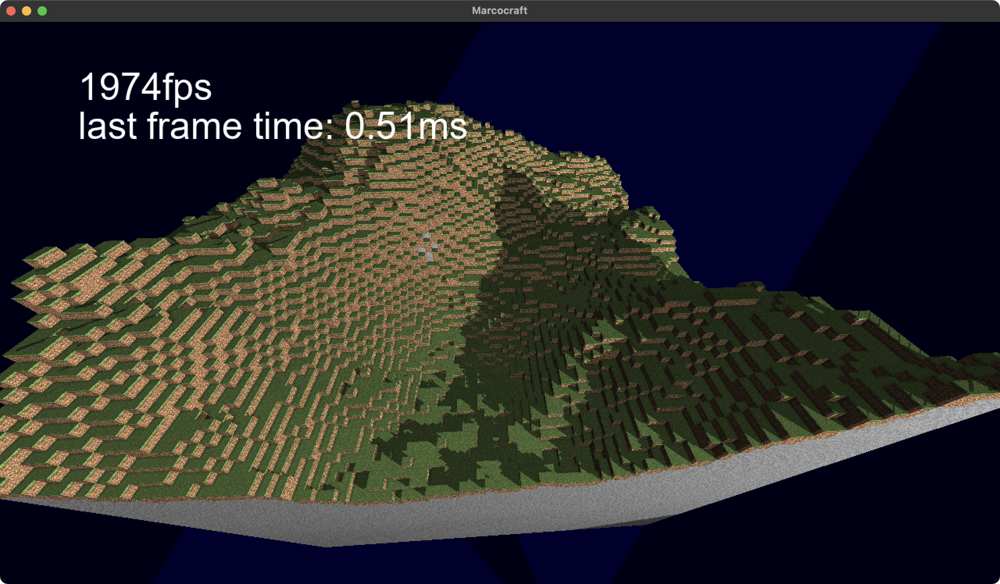

Just another unfinished Minecraft clone written in C++ using SDL2 and OpenGL.

(ignore the frame counter it's not using average frames)

Features implemented:
- Textures
    - Grass colored appropriately
- Phong shading
- 2D Text using freetype
- SSAO
- Naiive terrain generation using perlin noise
- Shadows

Features I'd like to implement at some point:
- Collision
- Infinite world generation and loading
- Editing world